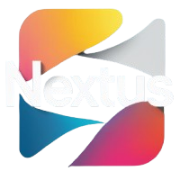

## Sobre a revista

A Revista NextUs é uma revista digital inovadora feita para conectar nossa escola. Trazemos matérias, novidades, área kids e muito mais, sempre com um design moderno e acessível. Nosso objetivo é informar, envolver e aproximar a comunidade escolar de forma criativa e interativa.

- Conteúdos e curiosidades de todas as matérias;.
- Conteúdo para todas as idades;
- Projetos e acontecimentos na escola;
- Explicações legíveis e interessantes para o aprendizado.

"Aprender hoje, transformar o amanhã."

## Entrar em contato

É possível entrar em contato com nossa equipe para discussões sobre o projeto com fins de melhora ou ajustes. Segue abaixo nossos meios de contato para mais informações:

- Confira no [GitHub]('https://github.com/ooaoJ');
- Mande um [Email]('')